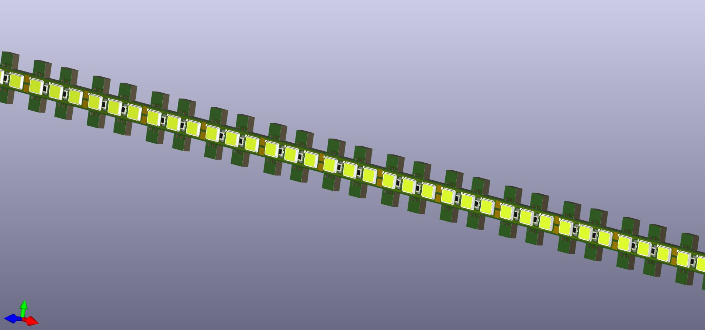
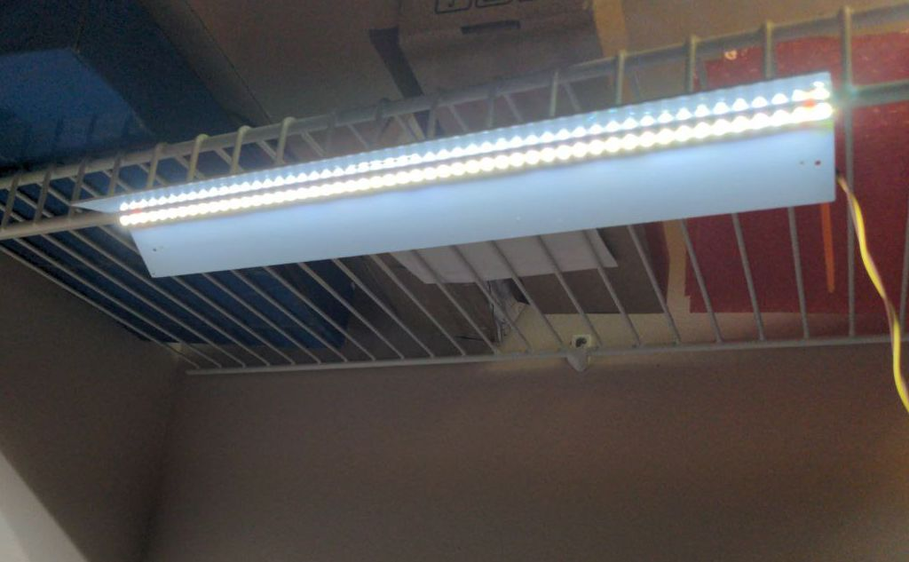

# kicad-Led-lanee
Cheap LED lamp in the form of a narrow strip. Single layer PCB design for aluminum die.

Cheap LEDs XL-2835UWC-02

Current < 1.5A

Voltage ~12V DC

Factory JLC

Current < 1.5A

Voltage +/- 12V DC

Factory JLC

License MIT

If you need a unique design of lamps and other complex circuit boards, hardware design, reproduction, reverse engineering, repair - write to me at contact@arduino.uno

Sergey Kostyanoy (с) 2023
